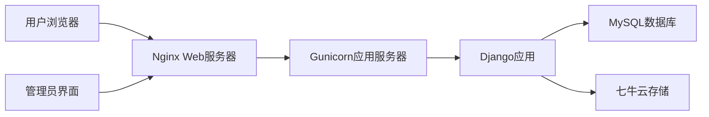

# 卡券回收平台开发文档

## 1. 项目概述

### 1.1 项目背景
开发一个卡券回收平台，用户可提交闲置卡券信息进行回收，管理员可审核处理提交记录。平台支持卡券图片上传、状态跟踪等功能。

### 1.2 系统角色
- **普通用户**：
  - 提交卡券回收申请
  - 查看个人提交记录及状态
- **管理员**：
  - 查看所有用户提交记录
  - 更新记录状态（待审核/已通过/已拒绝/已结算）
  - 添加管理备注

### 1.3 技术栈
| 类别   | 技术                                |
| ------ | ----------------------------------- |
| 前端   | Bootstrap 5 + jQuery                |
| 后端   | Django 4.x                          |
| 数据库 | MySQL 8.x                           |
| 云存储 | 七牛云对象存储                      |
| 部署   | Nginx+宝塔                          |
| 其他   | Django REST Framework (可选API扩展) |

---

## 2. 系统架构



---

## 3. 数据库设计

数据库设置：

DATABASES = {

  'default': {

​    'ENGINE': 'django.db.backends.mysql',

​    'NAME':  'card_recycling',    # 数据库名

​    'USER':  'connect',

​    'PASSWORD': 'Zhjh0704.',

​    'HOST': '8.153.77.15',

​    'PORT': '3306',

​    'OPTIONS':  {'charset': 'utf8mb4'},

  }

}

### 3.1 数据表

注意：用户表使用Django内置的auth_user表

1、category表：id,name

2、package表(套餐表)：id，category_id,name,commission(佣金)

3、submission表：id，user_id，category_id,package_id,commission,card_number,card_secret,image(核销码),expire_date,telephone,status,submitted_at,updated_at,admin_remark

---

## 4. 七牛云集成

### 4.1 配置设置 (settings.py)

```python
# 七牛云配置(华东)（上传到card_recycle文件夹下）
QINIU_ACCESS_KEY = 'nfxmZVGEHjkd8Rsn44S-JSynTBUUguTScil9dDvC'
QINIU_SECRET_KEY = '9lZjiRtRLL0U_MuYkcUZBAL16TlIJ8_dDSbTqqU2'
QINIU_BUCKET_NAME = 'youxuan-images'
QINIU_BUCKET_DOMAIN = 'https://guangpan.lingjing235.cn'  # 绑定的自定义域名
QINIU_SECURE_URL = True  # 使用HTTPS
QINIU_UPLOAD_MAX_SIZE = 10 * 1024 * 1024  # 最大10MB
```

### 4.2 上传工具类 (utils/qiniu_util.py)

```python
from qiniu import Auth, put_file, etag
import qiniu.config
from django.conf import settings
import uuid
import os

def generate_qiniu_token():
    """生成上传凭证"""
    q = Auth(settings.QINIU_ACCESS_KEY, settings.QINIU_SECRET_KEY)
    return q.upload_token(settings.QINIU_BUCKET_NAME, expires=3600)

def upload_to_qiniu(file_path, file_name=None):
    """上传文件到七牛云"""
    if not file_name:
        # 生成唯一文件名
        ext = os.path.splitext(file_path)[1]
        file_name = f"{uuid.uuid4().hex}{ext}"
    
    q = Auth(settings.QINIU_ACCESS_KEY, settings.QINIU_SECRET_KEY)
    token = q.upload_token(settings.QINIU_BUCKET_NAME, file_name)
    
    ret, info = put_file(token, file_name, file_path)
    
    if ret and ret.get('key') == file_name:
        return f"{settings.QINIU_BUCKET_DOMAIN}/{file_name}"
    return None
```

---

